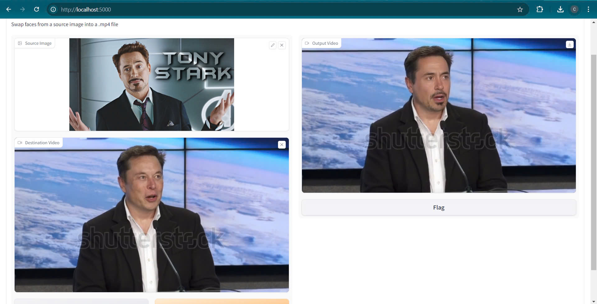

# Face Swap

[](https://colab.research.google.com/drive/1CJWwFcV0jCu5PSQzQXmVeh2WeTZbA1m6?usp=sharing)

👉 [Watch demo](https://drive.google.com/file/d/1UbqVzB4872PQH_JFKEiD2BbJVtxuJ7GX/view?usp=sharing)

Face Swap is a generative AI technology to swap faces (aka Deep Fake) in images from one to another. This is a one shot face-swap model; for this reason only one face is needed to swap. It should work for all kinds of content. The face swapping model itself was created by [Insightface](https://github.com/deepinsight/insightface)

:warning: Please, before using the code from this repository, make sure to read the [disclaimer](https://github.com/dxcanh/face_swap/tree/main#disclaimer).

## Installation

### Dependencies

1. FFmpeg

[Download and install FFmpeg](https://ffmpeg.org/download.html)

2. CUDA >= 10.1

[Download and install CUDA](https://developer.nvidia.com/cuda-10.1-download-archive-base)

3. Requirements

```powershell
git clone https://github.com/dxcanh/face_swap.git
cd face_swap
conda create -n face_swap python=3.8 -y
conda activate face_swap
pip install torch==1.11.0+cu115 torchvision==0.12.0+cu115 -f https://download.pytorch.org/whl/torch_stable.html
pip install -r requirements.txt
```

4. Download the [inswapper_128.onnx model](https://huggingface.co/thebiglaskowski/inswapper_128.onnx/tree/main) from Hugging Face and place it in buffalo_l folder of this project.

## Pipeline
Run application:
```powershell
python -m App.app
```
Now, you can access the application at localhost:5000

## Results
Below are images of the application interface.



## Special Thanks To
- [FFMpeg](https://github.com/FFmpeg/FFmpeg)
- [InsightFace](https://github.com/deepinsight/insightface)
- [Real-ESRGAN](https://github.com/xinntao/Real-ESRGAN)
- [GFPGAN](https://github.com/TencentARC/GFPGAN)
- [PyTorch](https://github.com/pytorch/pytorch)
- [Torchvision](https://github.com/pytorch/pytorch)

## Disclaimer

> :warning: This software is provided "as is", without warranty of any kind, express or implied, including but not limited to the warranties of merchantability, fitness for a particular purpose and noninfringement. In no event shall the authors or copyright holders be liable for any claim, damages or other liability, whether in an action of contract, tort or otherwise, arising from, out of or in connection with the software or the use or other dealings in the software.

> :warning: This software is intended for educational and research purposes only. It is not intended for use in any malicious activities. The author of this software does not condone or support the use of this software for any harmful actions, including but not limited to identity theft, invasion of privacy, or defamation. Any use of this software for such purposes is strictly prohibited.

> :warning: You may only use this software with images for which you have the right to use and the necessary permissions. Any use of images without the proper rights and permissions is strictly prohibited.

> :warning: The author of this software is not responsible for any misuse of the software or for any violation of rights and privacy resulting from such misuse.

> :warning: To prevent misuse, the software contains an integrated protective mechanism that prevents it from working with illegal or similar types of media.

> :warning: By using this software, you agree to abide by all applicable laws, to respect the rights and privacy of others, and to use the software responsibly and ethically.
